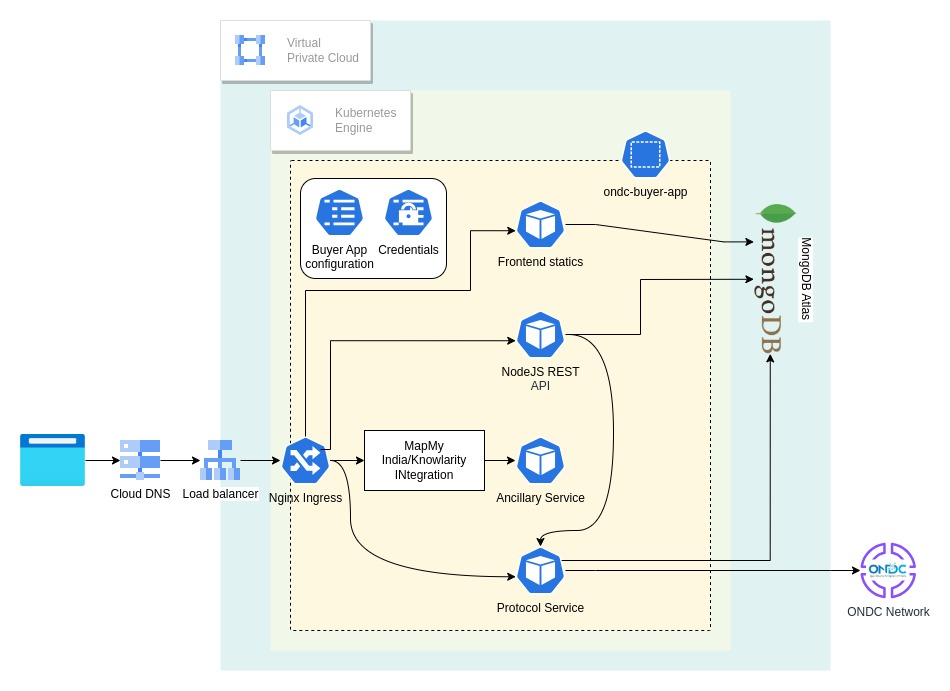

# ONE-CLICK Buyer App Deployer

# Overview

Deployer to deploy ONDC compliant Buyer Application on GCP Marketplace

## Architecture



By default, Buyer App Frontend service is exposed using a ClusterIP Service on port 80.

Separate StatefulSet Kubernetes objects are used to manage the MongoDB instance. A single instance of buyer-app is deployed as a single Pod, using a Kubernetes Deployment.

The buyer-app instance connects to MongoDB over port `27017`. A single instance of Postgres is deployed as a Pod, using a Kubernetes StatefulSet.


# Installation

## Quick install with Google Cloud Marketplace

Get up and running with a few clicks! Install this Buyer app to a Google
Kubernetes Engine cluster using Google Cloud Marketplace. Follow the
[on-screen instructions](https://console.cloud.google.com/marketplace/details/google/one-click-apps).


### Prerequisites

#### Set up command-line tools

You'll need the following tools in your development environment. If you are
using Cloud Shell, `gcloud`, `kubectl`, Docker, and Git are installed in your
environment by default.

-   [gcloud](https://cloud.google.com/sdk/gcloud/)
-   [kubectl](https://kubernetes.io/docs/reference/kubectl/overview/)
-   [docker](https://docs.docker.com/install/)
-   [git](https://git-scm.com/book/en/v2/Getting-Started-Installing-Git)
-   [openssl](https://www.openssl.org/)
-   [helm](https://helm.sh/)

Configure `gcloud` as a Docker credential helper:

```shell
gcloud auth configure-docker
```

#### Create a Google Kubernetes Engine (GKE) cluster

Create a new cluster from the command line:

```shell
export CLUSTER=buyer-app-cluster
export ZONE=us-west1-a

gcloud container clusters create "$CLUSTER" --zone "$ZONE"
```

Configure `kubectl` to connect to the new cluster:

```shell
gcloud container clusters get-credentials "$CLUSTER" --zone "$ZONE"
```

#### Clone this repo

Clone this repo and the associated tools repo:

```shell
git clone --recursive https://github.com/chaincodechd/ONE-CLICK-Buyer-App-GCP.git
```

#### Install the Application resource definition

An Application resource is a collection of individual Kubernetes components,
such as Services, Deployments, and so on, that you can manage as a group.

To set up your cluster to understand Application resources, run the following
command:

```shell
kubectl apply -f "https://raw.githubusercontent.com/GoogleCloudPlatform/marketplace-k8s-app-tools/master/crd/app-crd.yaml"
```

You need to run this command once.

The Application resource is defined by the
[Kubernetes SIG-apps](https://github.com/kubernetes/community/tree/master/sig-apps)
community. The source code can be found on
[github.com/kubernetes-sigs/application](https://github.com/kubernetes-sigs/application).

### Install the Application

To install using kubernetes manifest generated out of the templates of helm chart.

#### Configure the app with environment variables

Choose the instance name and namespace for the app. For most cases, you can use
the `default` namespace.

```shell
export APP_NAME=<APP_NAME>
export NAMESPACE=<NAMESPACE>
export APP_DOMAIN=<APP_DOMAIN>
export BIAP_CLIENT_NODE_JS_REPLICAS=<BIAP_CLIENT_NODE_JS_REPLICAS>
export BIAP_CLIENT_NODE_JS_IMAGE_REPO=<BIAP_CLIENT_NODE_JS_IMAGE_REPO>
export BIAP_CLIENT_NODE_JS_IMAGE_TAG=<BIAP_CLIENT_NODE_JS_IMAGE_TAG>
export BIAP_CLIENT_NODE_JS_CONFIGMAP_JUSPAY_WEBHOOK_USERNAME=<BIAP_CLIENT_NODE_JS_CONFIGMAP_JUSPAY_WEBHOOK_USERNAME>
export BIAP_CLIENT_NODE_JS_CONFIGMAP_JUSPAY_BASE_URL=<BIAP_CLIENT_NODE_JS_CONFIGMAP_JUSPAY_BASE_URL>
export BIAP_CLIENT_NODE_JS_CONFIGMAP_FIREBASE_ADMIN_SERVICE_ACCOUNT=<BIAP_CLIENT_NODE_JS_CONFIGMAP_FIREBASE_ADMIN_SERVICE_ACCOUNT>
export BIAP_CLIENT_NODE_JS_CONFIGMAP_DOMAIN=<BIAP_CLIENT_NODE_JS_CONFIGMAP_DOMAIN>
export BIAP_CLIENT_NODE_JS_CONFIGMAP_CITY=<BIAP_CLIENT_NODE_JS_CONFIGMAP_CITY>
export BIAP_CLIENT_NODE_JS_CONFIGMAP_COUNTRY=<BIAP_CLIENT_NODE_JS_CONFIGMAP_COUNTRY>
export BIAP_CLIENT_NODE_JS_CONFIGMAP_BIAP_UNIQUE_KEY_ID=<BIAP_CLIENT_NODE_JS_CONFIGMAP_BIAP_UNIQUE_KEY_ID>
export BIAP_CLIENT_NODE_JS_CONFIGMAP_PORT=<BIAP_CLIENT_NODE_JS_CONFIGMAP_PORT>
export BIAP_CLIENT_NODE_JS_CONFIGMAP_NODE_DEV=<BIAP_CLIENT_NODE_JS_CONFIGMAP_NODE_DEV>
export BIAP_CLIENT_NODE_JS_CONFIGMAP_ENV_TYPE=<BIAP_CLIENT_NODE_JS_CONFIGMAP_ENV_TYPE>
export BIAP_CLIENT_NODE_JS_CONFIGMAP_JUSPAY_MERCHANT_ID=<BIAP_CLIENT_NODE_JS_CONFIGMAP_JUSPAY_MERCHANT_ID>
export BIAP_CLIENT_NODE_JS_SECRET_JUSPAY_API_KEY=<BIAP_CLIENT_NODE_JS_SECRET_JUSPAY_API_KEY>
export BIAP_CLIENT_NODE_JS_SECRET_BAP_PRIVATE_KEY=<BIAP_CLIENT_NODE_JS_SECRET_BAP_PRIVATE_KEY>
export BIAP_CLIENT_NODE_JS_SECRET_BAP_PUBLIC_KEY=<BIAP_CLIENT_NODE_JS_SECRET_BAP_PUBLIC_KEY>
export BIAP_IGM_NODE_JS_REPLICAS=<BIAP_IGM_NODE_JS_REPLICAS>
export BIAP_IGM_NODE_JS_IMAGE_REPO=<BIAP_IGM_NODE_JS_IMAGE_REPO>
export BIAP_IGM_NODE_JS_IMAGE_TAG=<BIAP_IGM_NODE_JS_IMAGE_TAG>
export BIAP_IGM_NODE_JS_PORT=<BIAP_IGM_NODE_JS_PORT>
export BIAP_IGM_NODE_JS_CONFIGMAP_DOMAIN=<BIAP_IGM_NODE_JS_CONFIGMAP_DOMAIN>
export BIAP_IGM_NODE_JS_CONFIGMAP_COUNTRY=<BIAP_IGM_NODE_JS_CONFIGMAP_COUNTRY>
export BUYER_APP_FRONTEND_REPLICAS=<BUYER_APP_FRONTEND_REPLICAS>
export BUYER_APP_FRONTEND_IMAGE_REPO=<BUYER_APP_FRONTEND_IMAGE_REPO>
export BUYER_APP_FRONTEND_IMAGE_TAG=<BUYER_APP_FRONTEND_IMAGE_TAG>
export BUYER_APP_FRONTEND_CONFIGMAP_REACT_APP_FIREBASE_AUTH_DOMAIN=<BUYER_APP_FRONTEND_CONFIGMAP_REACT_APP_FIREBASE_AUTH_DOMAIN>
export BUYER_APP_FRONTEND_SECRET_REACT_APP_FIREBASE_API_KEY=<BUYER_APP_FRONTEND_SECRET_REACT_APP_FIREBASE_API_KEY>
export MMI_CLIENT_REPLICAS=<MMI_CLIENT_REPLICAS>
export MMI_CLIENT_PORT=<MMI_CLIENT_PORT>
export MMI_CLIENT_IMAGE_REPO=<MMI_CLIENT_IMAGE_REPO>
export MMI_CLIENT_IMAGE_TAG=<MMI_CLIENT_IMAGE_TAG>
export MMI_CLIENT_SECRET_MMI_CLIENT_ID=<MMI_CLIENT_SECRET_MMI_CLIENT_ID>
export MMI_CLIENT_SECRET_MMI_CLIENT_SECRET=<MMI_CLIENT_SECRET_MMI_CLIENT_SECRET>
export MMI_CLIENT_SECRET_MMI_ADVANCE_API_KEY=<MMI_CLIENT_SECRET_MMI_CLIENT_ID>
export MONGO_REPLICAS=<MONGO_REPLICAS>
export MONGO_PORT=<MONGO_PORT>
export MONGO_IMAGE_REPO=<MONGO_IMAGE_REPO>
export MONGO_IMAGE_TAG=<MONGO_IMAGE_TAG>
export MONGO_STORAGE_SIZE=<MONGO_STORAGE_SIZE>
export PY_ONDC_PROTOCOL_REPLICAS=<PY_ONDC_PROTOCOL_REPLICAS>
export PY_ONDC_PROTOCOL_PORT=<PY_ONDC_PROTOCOL_PORT>
export PY_ONDC_PROTOCOL_IMAGE_REPO=<PY_ONDC_PROTOCOL_IMAGE_REPO>
export PY_ONDC_PROTOCOL_IMAGE_TAG=<PY_ONDC_PROTOCOL_IMAGE_TAG>
export PY_ONDC_PROTOCOL_SECRET_BAP_PRIVATE_KEY=<PY_ONDC_PROTOCOL_SECRET_BAP_PRIVATE_KEY>
export PY_ONDC_PROTOCOL_SECRET_BAP_PUBLIC_KEY=<PY_ONDC_PROTOCOL_SECRET_BAP_PUBLIC_KEY>
```

#### Expand the manifest template

Use `helm template` to expand the template. We recommend that you save the
expanded manifest file for future updates to the application.

```shell
helm template "$APP_NAME" chart/ONE-CLICK-Buyer-App \
  --namespace "$NAMESPACE" \
  --set appName="$APP_NAME" \
  --set appDomain="$APP_DOMAIN" \
  --set biapClientNodeJS.replicas="$BIAP_CLIENT_NODE_JS_REPLICAS" \
  --set biapClientNodeJS.image.repo="$BIAP_CLIENT_NODE_JS_IMAGE_REPO" \
  --set biapClientNodeJS.image.tag="$BIAP_CLIENT_NODE_JS_IMAGE_TAG" \
  --set biapClientNodeJS.configMap.juspay_webhook_username="$BIAP_CLIENT_NODE_JS_CONFIGMAP_JUSPAY_WEBHOOK_USERNAME" \
  --set biapClientNodeJS.configMap.juspay_base_url="$BIAP_CLIENT_NODE_JS_CONFIGMAP_JUSPAY_BASE_URL" \
  --set biapClientNodeJS.configMap.firebase_admin_service_account="$BIAP_CLIENT_NODE_JS_CONFIGMAP_FIREBASE_ADMIN_SERVICE_ACCOUNT" \
  --set biapClientNodeJS.configMap.domain="$BIAP_CLIENT_NODE_JS_CONFIGMAP_DOMAIN" \
  --set biapClientNodeJS.configMap.city="$BIAP_CLIENT_NODE_JS_CONFIGMAP_CITY" \
  --set biapClientNodeJS.configMap.country="$BIAP_CLIENT_NODE_JS_CONFIGMAP_COUNTRY" \
  --set biapClientNodeJS.configMap.bap_unique_key_id="$BIAP_CLIENT_NODE_JS_CONFIGMAP_BIAP_UNIQUE_KEY_ID" \
  --set biapClientNodeJS.configMap.port="$BIAP_CLIENT_NODE_JS_CONFIGMAP_PORT" \
  --set biapClientNodeJS.configMap.node_dev="$BIAP_CLIENT_NODE_JS_CONFIGMAP_NODE_DEV" \
  --set biapClientNodeJS.configMap.env_type="$BIAP_CLIENT_NODE_JS_CONFIGMAP_ENV_TYPE" \
  --set biapClientNodeJS.configMap.juspay_merchant_id="$BIAP_CLIENT_NODE_JS_CONFIGMAP_JUSPAY_MERCHANT_ID" \
  --set biapClientNodeJS.secret.juspay_api_key="$BIAP_CLIENT_NODE_JS_SECRET_JUSPAY_API_KEY" \
  --set biapClientNodeJS.secret.bap_private_key="$BIAP_CLIENT_NODE_JS_SECRET_BAP_PRIVATE_KEY" \
  --set biapClientNodeJS.secret.bap_public_key="$BIAP_CLIENT_NODE_JS_SECRET_BAP_PUBLIC_KEY" \
  --set biapIGMNodeJS.replicas="$BIAP_IGM_NODE_JS_REPLICAS" \
  --set biapIGMNodeJS.image.repo="$BIAP_IGM_NODE_JS_IMAGE_REPO" \
  --set biapIGMNodeJS.image.tag="$BIAP_IGM_NODE_JS_IMAGE_TAG" \
  --set biapIGMNodeJS.port="$BIAP_IGM_NODE_JS_PORT" \
  --set biapIGMNodeJS.configMap.domain="$BIAP_IGM_NODE_JS_CONFIGMAP_DOMAIN" \
  --set biapIGMNodeJS.configMap.country="$BIAP_IGM_NODE_JS_CONFIGMAP_COUNTRY" \
  --set buyerAppFrontend.replicas="$BUYER_APP_FRONTEND_REPLICAS" \
  --set buyerAppFrontend.image.repo="$BUYER_APP_FRONTEND_IMAGE_REPO" \
  --set buyerAppFrontend.image.tag="$BUYER_APP_FRONTEND_IMAGE_TAG" \
  --set buyerAppFrontend.configMap.react_app_firebase_auth_domain="$BUYER_APP_FRONTEND_CONFIGMAP_REACT_APP_FIREBASE_AUTH_DOMAIN" \
  --set buyerAppFrontend.secret.react_app_firebase_api_key="$BUYER_APP_FRONTEND_SECRET_REACT_APP_FIREBASE_API_KEY" \
  --set mmiClient.replicas="$MMI_CLIENT_REPLICAS" \
  --set mmiClient.port="$MMI_CLIENT_PORT" \
  --set mmiClient.image.repo="$MMI_CLIENT_IMAGE_REPO" \
  --set mmiClient.image.tag="$MMI_CLIENT_IMAGE_TAG" \
  --set mmiClient.secret.mmi_client_id="$MMI_CLIENT_SECRET_MMI_CLIENT_ID" \
  --set mmiClient.secret.mmi_client_secret="$MMI_CLIENT_SECRET_MMI_CLIENT_SECRET" \
  --set mmiClient.secret.mmi_advance_api_key="$MMI_CLIENT_SECRET_MMI_ADVANCE_API_KEY" \
  --set mongo.replicas="$MONGO_REPLICAS" \
  --set mongo.port="$MONGO_PORT" \
  --set mongo.image.repo="$MONGO_IMAGE_REPO" \
  --set mongo.image.tag="$MONGO_IMAGE_TAG" \
  --set mongo.storageSize="$MONGO_STORAGE_SIZE" \
  --set pyOndcProtocol.replicas="$PY_ONDC_PROTOCOL_REPLICAS" \
  --set pyOndcProtocol.port="$PY_ONDC_PROTOCOL_PORT" \
  --set pyOndcProtocol.image.repo="$PY_ONDC_PROTOCOL_IMAGE_REPO" \
  --set pyOndcProtocol.image.tag="$PY_ONDC_PROTOCOL_IMAGE_TAG" \
  --set pyOndcProtocol.secret.bap_private_key="$PY_ONDC_PROTOCOL_SECRET_BAP_PRIVATE_KEY" \
  --set pyOndcProtocol.secret.bap_public_key="$PY_ONDC_PROTOCOL_SECRET_BAP_PUBLIC_KEY" \
  > "${APP_NAME}_manifest.yaml"
```

#### Apply the manifest to your Kubernetes cluster

Use `kubectl` to apply the manifest to your Kubernetes cluster:

```shell
kubectl apply -f "${APP_NAME}_manifest.yaml" --namespace "${NAMESPACE}"
```

# To install the app using helm chart with the help of helm cli

Set the below env. variables required by the helm chart

```
appName
appDomain
biapClientNodeJS.replicas
biapClientNodeJS.image.repo
biapClientNodeJS.image.tag
biapClientNodeJS.configMap.juspay_webhook_username
biapClientNodeJS.configMap.juspay_base_url
biapClientNodeJS.configMap.firebase_admin_service_account
biapClientNodeJS.configMap.domain
biapClientNodeJS.configMap.city
biapClientNodeJS.configMap.country
biapClientNodeJS.configMap.bap_unique_key_id
biapClientNodeJS.configMap.port
biapClientNodeJS.configMap.node_dev
biapClientNodeJS.configMap.env_type
biapClientNodeJS.configMap.juspay_merchant_id
biapClientNodeJS.secret.juspay_api_key
biapClientNodeJS.secret.bap_private_key
biapClientNodeJS.secret.bap_public_key
biapIGMNodeJS.replicas
biapIGMNodeJS.image.repo
biapIGMNodeJS.image.tag
biapIGMNodeJS.port
biapIGMNodeJS.configMap.domain
biapIGMNodeJS.configMap.country
buyerAppFrontend.replicas
buyerAppFrontend.image.repo
buyerAppFrontend.image.tag
buyerAppFrontend.configMap.react_app_firebase_auth_domain
buyerAppFrontend.secret.react_app_firebase_api_key
mmiClient.replicas
mmiClient.port
mmiClient.image.repo
mmiClient.image.tag
mmiClient.secret.mmi_client_id
mmiClient.secret.mmi_client_secret
mmiClient.secret.mmi_advance_api_key
mongo.replicas
mongo.port
mongo.image.repo
mongo.image.tag
mongo.storageSize
pyOndcProtocol.replicas
pyOndcProtocol.port
pyOndcProtocol.image.repo
pyOndcProtocol.image.tag
pyOndcProtocol.secret.bap_private_key
pyOndcProtocol.secret.bap_public_key

```

Set the below env. variables. 

```
export NAMESPACE=default   # Or the namespace where this app is deployed
export APP_NAME=buyer-app # Or the name of the app used during the deployment
```

#### Create namespace in your Kubernetes cluster

If you use a different namespace than `default`, or the namespace does not exist
yet, run the command below to create a new namespace:

```shell
kubectl create namespace "$NAMESPACE"
```

#### Install the chart using helm cli 

```
helm install ${APP_NAME} ONE-CLICK-Buyer-App/ -f ONE-CLICK-Buyer-App/values.yaml -n ${NAMESPACE}
```

Check if the services defined in helm chart are all running fine using the below command,

```
kubectl get pods -n ${NAMESPACE}
```

Forward the Server UI port locally:

```
kubectl port-forward \
--namespace "${NAMESPACE}" \
svc/"${APP_NAME}-frontend" 8000:80
```

Access the UI at http://localhost:8000/


#### View the app in the Google Cloud Console

To get the GCP Console URL for your app, run the following command:

```shell
echo "https://console.cloud.google.com/kubernetes/application/${ZONE}/${CLUSTER}/${NAMESPACE}/${APP_NAME}"
```

# Uninstall the Application

## Using the Google Cloud Platform Console

1.  In the GCP Console, open
    [Kubernetes Applications](https://console.cloud.google.com/kubernetes/application).

1.  From the list of applications, click **buyer-app**.

1.  On the Application Details page, click **Delete**.

## Using the command line


Set the below env. variables. 

```
export NAMESPACE=default   # Or the namespace where this app is deployed
export APP_NAME=buyer-app # Or the name of the app used during the deployment
```

### Delete the resources

Using helm cli, uninstall the installed chart from your cluster.

```
helm uninstall ${APP_NAME} -n ${NAMESPACE}
```